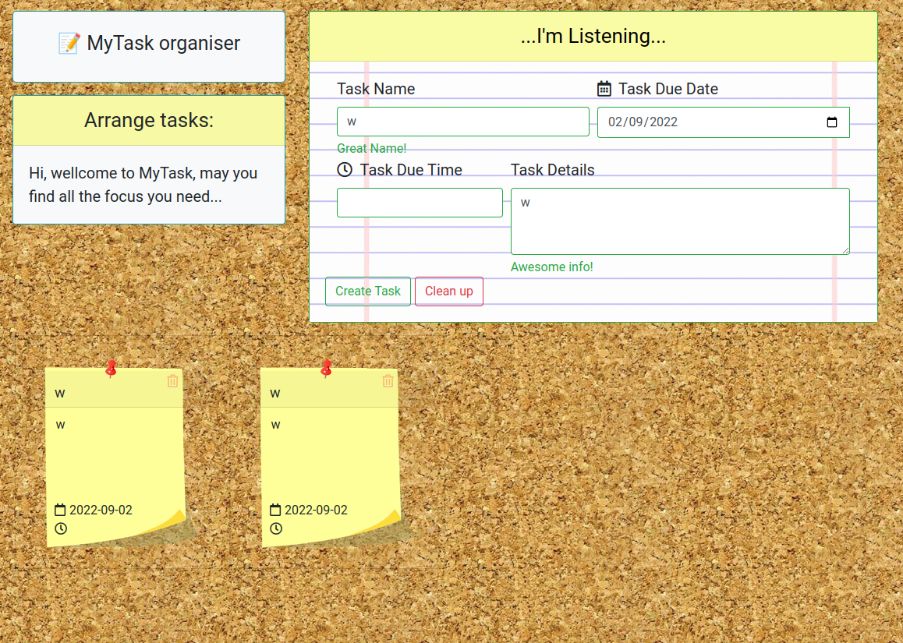

# The Tasks project:  MyTask organiser

Hi and wellcome to this renewal of a John Bryce project I had running two years ago.
what has changed and why did I rebuilt this project?
first of all a lot has changed for me. I've recently accomplished a DevOps bootcamp and 
armed with this knowledge I plan to revisit my old projects and to spin them up properly.

let's examine the old code repository:

and it looked like this:

