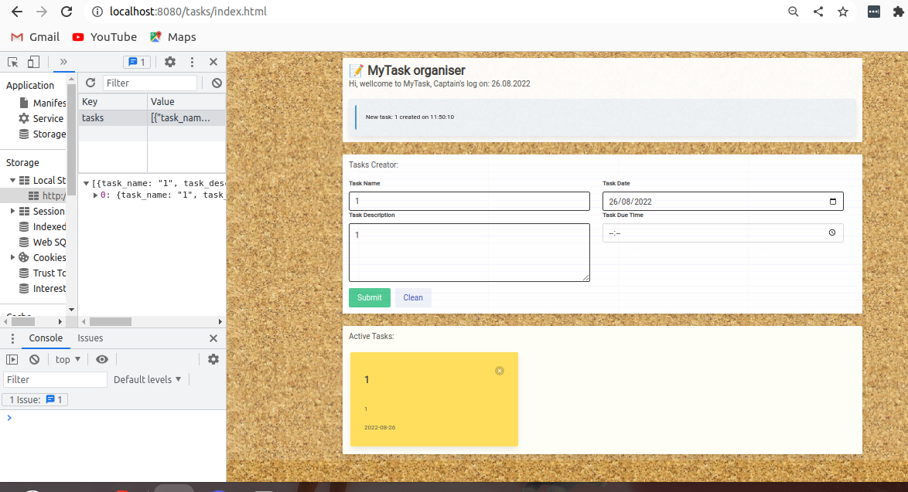

# The Tasks project:  MyTask organiser

Hi and wellcome to this renewal of a John Bryce project I had running two years ago.
what has changed and why did I rebuilt this project?
first of all a lot has changed for me. I've recently accomplished a DevOps bootcamp and 
armed with this knowledge I plan to revisit my old projects and to spin them up properly.

let's examine the old code repository:

and it looked like this:

as you can see under the hood the old project had 4 js files:
https://github.com/johnmogi/johnmogi.github.io/tree/72559cdcd08fb0074eec7742820c3002edd6cec8/Tasks/build

altough it's not impossible to maintain even when I cone to revisit the code it looks extremely complex.

so consilidating everything into one small file sounds much better

## the new tasks project:

so apart from the time it took me (I think it took me around 5 hours - mainly because i had to remember stuff)
